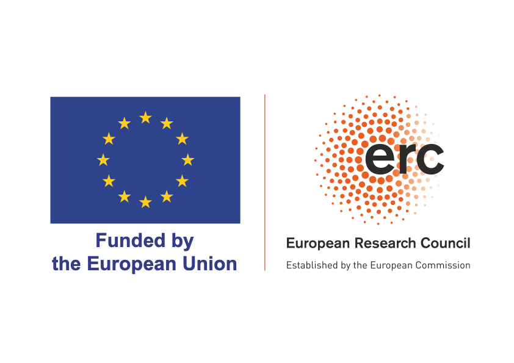

## Citation

To cite these materials, please use

-   Hohmann, N., Liu, X., & Jarochowska, E. (2025). Materials for workshop on building modeling pipelines in stratigraphic paleobiology (v1.0.0). Zenodo. <https://doi.org/10.5281/zenodo.13769443>

## Contact information

#### **Niklas Hohmann**

email: n.h.hohmann \[at\] uu.nl

#### **Emilia Jarochowska**

email: e.b.jarochowska \[at\] uu.nl

## Acknowledgements

Thanks to Joël Koelewijn (ORCID: [0000-0002-4668-3797](https://orcid.org/0000-0002-4668-3797)) for helping out with the workshop at the annual meeting of the Paleontological Association 2025 in Portsmouth, UK.

## Funding information

Funded by the European Union (ERC, MindTheGap, StG project no 101041077). Views and opinions expressed are however those of the author(s) only and do not necessarily reflect those of the European Union or the European Research Council. Neither the European Union nor the granting authority can be held responsible for them. European Union and European Research Council logos

## License

Text - [Creative Commons Attribution 4.0 International](https://creativecommons.org/licenses/by/4.0/deed.en)

Code - [Apache-2.0](https://www.apache.org/licenses/LICENSE-2.0)
