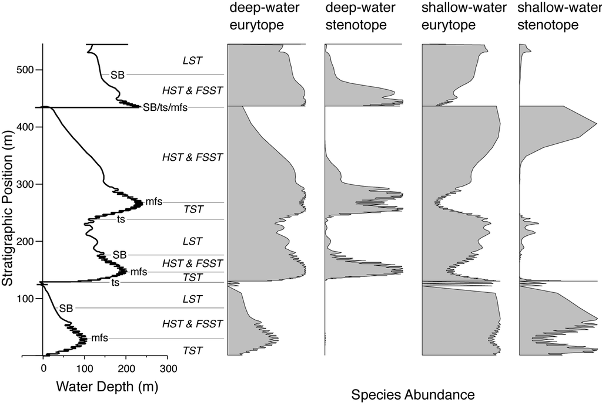

## Fossil occurrences, niche modeling and last occurrences (45 min)

```{r setup, include=FALSE}
knitr::opts_chunk$set(echo = TRUE)
set.seed(19917)
```

In this practical, we explore niche models, and how you can Build Your Own Mass Extinction (BYOME) using stratigraphic paleobiology.

## Introduction

A classic question in Stratigraphic Paleobiology is how stratigraphic architectures shape where we can find fossils, how abundant they are, and how this changes our understanding of origination and extinction events.



For computational simplicity, here we group first/last occurrences of a group of taxa and fossil occurrences of a single taxon together and refer to them as "event type data", which is similarly overprinted by stratigraphic effects [@hohmann_stratpal_mee_2025].

Event type data encompasses all types of data that are associated with a time/age or a stratigraphic position. As such, sampling locations, times of extinctions, and sequence stratigraphic boundaries are all examples of event type data.

For this practical, we focus on the most relevant event type data for paleontologists, which is fossil abundance and the derived first and last occurrences. We explore how stratigraphic and ecological effects change fossil abundance, how stratigraphic architectures generate artefactual peaks of last occurrences that can be mistaken for mass extinctions, and explore some implications for geochronology, more specifically the precision of biostratigraphy.

## Coding cheat sheet

### Simulating fossil occurrences

Fossil locations or ages can be simulated using the `p3` function if the rate of fossil occurrences is constant:

```{r event_data_1}
library(StratPal)
library(admtools)
pos = "2km"
adm = tp_to_adm(t = scenarioA$t_myr,        
                             h = scenarioA$h_m[,pos],
                             T_unit = "Myr",
                             L_unit = "m")
rate = 300                           # 300 fossils per Myr
p3(rate = rate, from = 0, to = 1) |> 
  hist(main = "Fossil abundance",
       xlab = "Time [Myr]",
       ylab = "# Specimens")
```

For time-variable rates see `p3_var_rate`.

### Transforming fossil occurrences to the stratigraphic domain

You can transform fossil ages directly using `time_to_strat`:

```{r event_data_fossil_age_transformation}
foss_per_myr = 300                                            # fossils per Myr
p3(rate = foss_per_myr, from = min_time(adm), to = max_time(adm)) |>         # constant rate in time domain
  time_to_strat(adm, destructive = TRUE) |>         # transform into depth domain
  hist(xlab = paste0("Stratigraphic height [",get_L_unit(adm),"]"),     # plot
       main = "Fossil abundance 2 km offshore",
       ylab = "# Fossils",
       breaks = seq(from = min_height(adm), to = max_height(adm), length.out = 20))
```

Note the option `destructive = TRUE` for `time_to_strat`. It makes sure fossils that coincide with hiatuses are destroyed.

### Defining niche models

You can define simple niche models with the functions `snp_niche` or `bounded_niche`:

```{r event_data_define_niche}
my_niche = snd_niche(opt = 10,       # preferred water depth 
                     tol = 5,        # tolerance to water depth fluctuations
                     # cut off negative values - the taxon does not survive on land
                     cutoff_val = 0) 
```

To visualize the niche you can plot it using the following code:

```{r event_data_plot_niche}
max_wd = 60                                     # maximum water depth
x = seq(-2, max_wd, by = 0.1)
plot(x, my_niche(x),
     type = "l",
     xlab = "Water depth [m]",
     ylab = "Collection probability",
     main = "Collection probability of taxon")
```

### Apply niche models

To apply a niche model, we need two components: A niche definition that specifies the niche of a taxon along a cline (water depth in this example - this is the function we defined above), and a function that describes how the cline changes with time.

::: callout-tip
### Cline

A cline is an environmental gradient, e.g. altitude is a cline important for plant diversity. Ecological niches are often defined in terms of distributions of occurrence probability along a cline.
:::

To define a function that returns the water depth with time, you can use the following code:

```{r event_data_def_water_depth}
pos = "2km"                 # position in the platform we want water depth from
# time steps where water depth is determined by the model
t = scenarioA$t_myr         
wd = scenarioA$wd_m[,pos]   # water depth 2 km from shore
gc = approxfun(t, wd)       # use linear interpolation between known water depths
```

You can visualize this function using the following code:

```{r event_data_plot_water_depth}
plot(x = t,
     y = gc(t), 
     type = "l", 
     xlab = "Time [Myr]",
     ylab = "Water depth [m]",
     main = "Water depth 2 km offshore")
```

With both components (niche definition and cline change with time) defined, you can insert the niche model into the modeling pipeline via the function `apply_niche`:

```{r event_data_apply_niche}
p3(rate = foss_per_myr, from = min_time(adm), to = max_time(adm)) |>         # model occurrences based on constant rate
  apply_niche(niche_def = my_niche, gc = gc) |>                              # apply niche model
  time_to_strat(adm, destructive = TRUE) |>                                  # transform into strat. domain, destroy fossils that coincide with hiatuses 
  hist(xlab = paste0("Stratigraphic height [",get_L_unit(adm) ,"]"),         # plot results
       main = "Fossil abundance 2 km from shore",
       ylab = "# Fossils",
       breaks = seq(from = min_height(adm), to = max_height(adm), length.out = 40))
```

### Simulating and transforming last occurrences

Timing of last occurrences can be simulated using `p3` or `p3_var_rate` just as fossil occurrence (or any other type of "event" data). They can be transformed using `time_to_strat`:

```{r event_data_last_occ}
rolo = 100                          # rate of last occurrences [per Myr]
p3(rate = rolo, from = min_time(adm), to = max_time(adm)) |>  # constant rate of LOs
  time_to_strat(adm, destructive = FALSE) |>      # non-destructive transformation!
  hist(xlab = paste0("Stratigraphic height [",get_L_unit(adm),"]"), # plot histogram
       main = "Last occurrences 2 km offshore",
       ylab = "# Last occurrences",
       breaks = seq(from = min_height(adm), to = max_height(adm), length.out = 20))
```

Note that we use the option `destructive = FALSE` in `time_to_strat`. This is because last occurrences during a hiatus will appear at the hiatus surface in the stratigraphic domain given the taxon is sufficiently abundant.

### Biostratigraphic precision (range offset)

Biostratigraphic precision is expressed as *range offset*, which is the difference between the true time of extinction and the last occurrence of a taxon. To determine it, you can use the wrapper function `range_offset`:

```{r event_data_range_offset}
t_ext = 1.5 # true time of extinction
rate = 10 # fossil abundance (per Myr)
r_offset = range_offset(t_ext = t_ext,
             rate = rate,
             adm = adm)
r_offset
```

This determines the range offset both in the stratigraphic domain (height difference between the last fossil found and the extinction horizon) and the time domain (time difference between the true age of extinction and the last preserved fossil). Here the stratigraphic range offset is `r round(r_offset["h"], 2)` meters and the temporal range offset is `r round(r_offset["t"], 2)` Myr. See `?range_offset` for advanced usage, which includes the incorporation of variable rates, taphonomy, and ecology.

## Tasks

::: callout-important
### Task 3.1: Fossil abundance in the stratigraphic domain

Simulate an abundant taxon and transform the fossil ages into the stratigraphic domain.

At which locations and stratigraphic heights do you observe peaks in fossil abundance?\
With which stratigraphic effects are these peaks associated?
:::

::: callout-important
### Task 3.2: Ecological controls on fossil abundance

Define a niche for a taxon and add the niche model to your pipeline from task 1.

How and why do your results change?\
How could you misinterpret the results?
:::

::: callout-important
### Task 3.3: Last occurrences and artefactual mass extinctions

Simulate last occurrences based on the assumption of a constant rate of last occurrences and transform them into the stratigraphic domain.

Where do you observe clusters of last occurrences?\
With what stratigraphic effects are these locations associated?\
How would you misinterpret the results in the absence of stratigraphic information?\
Use your results to formulate a "stratigraphic null hypothesis" for clusters of last occurrences.
:::

::: callout-important
### Task 3.4: Biostratigraphic precision and range offset

Explore how range offset changes with the true time of extinction, fossil abundance, and position along shore.

Where and why is biostratigraphic precision best/worst?\
How do your results change when you add a niche model to your code?
:::

## Solutions

::: {.callout-note collapse="true"}
### Solution Task 3.1: Fossil abundance in the stratigraphic domain.

Simulate an abundant taxon, and transform the fossil ages into the stratigraphic domain.

At which locations and stratigraphic heights do you observe peaks in fossil abundance?With which stratigraphic effects are these peaks associated?

We start by collecting all age-depth models for convenience.

```{r task_3_1_solution_fossil_abundance}

adm_list = list()                                 # storage for age-depth models
dist = paste(seq(2, 12, by = 2), "km", sep = "")      # distances from shore
for (pos in dist){                            # construct ADMs for all distances
  adm_list[[pos]] = tp_to_adm(t = scenarioA$t_myr,        
                             h = scenarioA$h_m[,pos],
                             T_unit = "Myr",
                             L_unit = "m")
}


pos = "12km"              # position in the platform, to modify
stopifnot(pos %in% dist) # validity check
adm = adm_list[[pos]]    # select ADM
rate = 2000               # fossil occurrences per Myr
sampl_bin = 2            # sampling bins in m
# Plot fossil abundance in the section
p3(from = min_time(adm), to = max_time(adm), rate = rate) |>
  time_to_strat(adm, destructive = TRUE) |>
  hist(breaks = seq(from = min_height(adm), to = max_height(adm) + sampl_bin, by = sampl_bin),
       xlab = "Stratigraphic height [m]",
       main = paste0("Fossil abundance ", pos, " from shore"))
```

The constant fossil abundance in the time domain is expressed as irregular patterns in the stratigraphic domain, with increased irregularity when the number of simulated fossils (rate) is low. Peaks in fossil abundance correspond to decreased sediment accumulation as accomodation space is rapidly filled when the platform is flooded. Notably, hiatuses do not cause any peaks in fossil abundance, as we specified that fossils coindicing with gaps will be destroyed (option `destructive = TRUE`).
:::

::: {.callout-note collapse="true"}
### Solution Task 3.2: Ecological controls on fossil abundance.

Define a niche for a taxon, and add the niche model to your pipeline.

How and why do your results change?\
How could you misinterpret the results?

```{r task_3_2_solution_ecology}
pos = "2km"              # select position on the platform
stopifnot(pos %in% dist) # check validity
adm = adm_list[[pos]]    # select age-depth model
rate = 200               # no. of fossils per Myr
# define niche
niche = snd_niche(opt = 20, tol = 10, cutoff_val = 0)
# plot niche
max_wd = 60                    # maximum water depth for plotting
x = seq(-2, max_wd, by = 0.1)
plot(x, niche(x),
     type = "l",
     xlab = "Water depth [m]",
     ylab = "Collection probability",
     main = "Collection probability of taxon")
## change in cline with time
t = scenarioA$t_myr        # time steps where the water depth is determined by the model
wd = scenarioA$wd_m[,pos]  # water depth at the specified position
wd_with_time = approxfun(t, wd)
## Plotting
plot(x = t,
     y = wd_with_time(t), 
     type = "l", 
     xlab = "Time [Myr]",
     ylab = "Water depth [m]",
     main = paste0("Water depth ", pos, " offshore"))
## add niche model to pipeline
p3(rate = rate, from = min_time(adm), to = max_time(adm)) |>         # model occurrences based on constant rate
  apply_niche(niche_def = niche, gc = wd_with_time) |>               # apply niche model
  time_to_strat(adm, destructive = TRUE) |>                          # transform into strat. domain, destroy fossils that coincide with hiatuses 
  hist(xlab = paste0("Stratigraphic height [",get_L_unit(adm) ,"]"), # plot results
       main = paste0("Fossil abundance ", pos, " from shore"),
       ylab = "# Fossils",
       breaks = seq(from = min_height(adm), to = max_height(adm), length.out = 40))
```

Depending on the preferred water depth and tolerance to water depth changes, it can appear as if the taxon goes extinct because fossil abundance drops to 0. However, this is because the taxon tracks its niche, and there is a systematic change in water depth with time.

For example, the water depth on the platform decreases with time, as the carbonate production rate outpaces the subsidence. As a result, taxa with low tolerance to shallow water will vanish over time from the platform top. Conversely, the water depth on the slope increase with time. This leads to the local extinction (extirpation) of shallow water taxa on the slope as time progresses. However, this local extinction does not mean that the taxon is extinct, just that the environment at that location became unfavorable for it. Without the ability to examine multiple sections in the samples, this might be mistaken as a true extinction event.
:::

::: {.callout-note collapse="true"}
### Solution Task 3.3: Last occurrences and artefactual mass extinctions

Simulate last occurrences based on the assumption of a constant rate of last occurrences and transform them into the stratigraphic domain.

-   Where do you observe clusters of last occurrences?

-   With what stratigraphic effects are these locations associated?

-   How would you misinterpret the results in the absence of stratigraphic information? Use your results to formulate a "stratigraphic null hypothesis" for clusters of last occurrences.

```{r task_3_3_last_occ}
pos = "2km"               # position along the onshore-offshore gradient
stopifnot(pos %in% dist)  # validity check
adm = adm_list[[pos]]     # select age-depth model
rate = 100                # last occurrences per Myr
binsize = 2               # size of sampling bins [m]

# Plot last occurrences at the specified position
p3(from = min_time(adm), to = max_time(adm), rate = rate) |>  
  time_to_strat(adm, destructive = FALSE) |>
  hist(breaks = seq(from = min_height(adm), to = max_height(adm) + binsize, by = binsize),
       xlab = "Height [m]",
       main = paste0(" # Last occurrences ", pos, " from shore"))
```

On the platform, the clusters are associated with prolonged hiatuses, caused by drops in sea level..

In the absence of stratigraphic information, these clusters could be misinterpreted as extinction intervals, as there is an elevated rate of last occurrences. If information on sea level change is available, this could be misinterpreted as a causal relationship between sea level and extinction rate, where drops in sea level increase extinction rates.

A stratigraphic null hypothesis might be that times of dropping sea level cause hiatuses close to shore, which lead apparent elevated extinction rates.
:::

::: {.callout-note collapse="true"}
### Solution Task 3.4: Biostratigraphic precision and range offset.

Explore how range offset changes with the true time of extinction, fossil abundance, and position along shore.

Where and why is biostratigraphic precision best/worst?\
How do your results change when you add a niche model to your code?

To generate more simulations, we write a wrapper function that draws range offset 1000 times for any given parameter choice:

```{r task_3_4_solution_range_offset}
sample_range_offset = function(t_ext, rate, adm, n_rep = 1000){
  t = rep(NA, n_rep)
  h = rep(NA, n_rep)
  for (i in 1:n_rep){
    x = range_offset(t_ext = t_ext, rate = rate, adm = adm)
    t[i] = x["t"]
    h[i] = x["h"]
  }
  return(list(t = t, h = h))
}
adm = adm_list[["2km"]]
t_ext = 1.5
rate = 5

range_offsets = sample_range_offset(t_ext, rate, adm)

hist(range_offsets$h,
     xlab = "Range offset [m]",
     main = "Biostratigraphic precision/Stratigraphic range offset")

hist(range_offsets$t,
     xlab = "Range offset [Myr]",
     main = "Biostratigraphic precision/Temporal range offset")
```

Running this code across the platform with varying rates and true extinction times, the following patterns emerge:

-   Range offset increases as fossil abundance decreases - the fewer fossils there are to find the further the last observed occurrence will be from the true extinction, an effect called the Signor-Lipps effect [@signor1982].

-   Temporal range offset is highest when the true extinction lies at the end of a gap. As a result, range offset is highest on the platform top in the presence of prolonged hiatuses caused by drops in sea level.

-   Adding niche models to the code does further increase the range offset (and, as a result, decrease stratigraphic precision) as it further decreases fossil abundance, and adds extirpation effects to range offset.
:::
