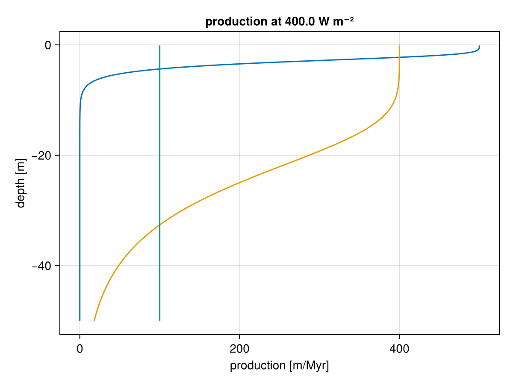
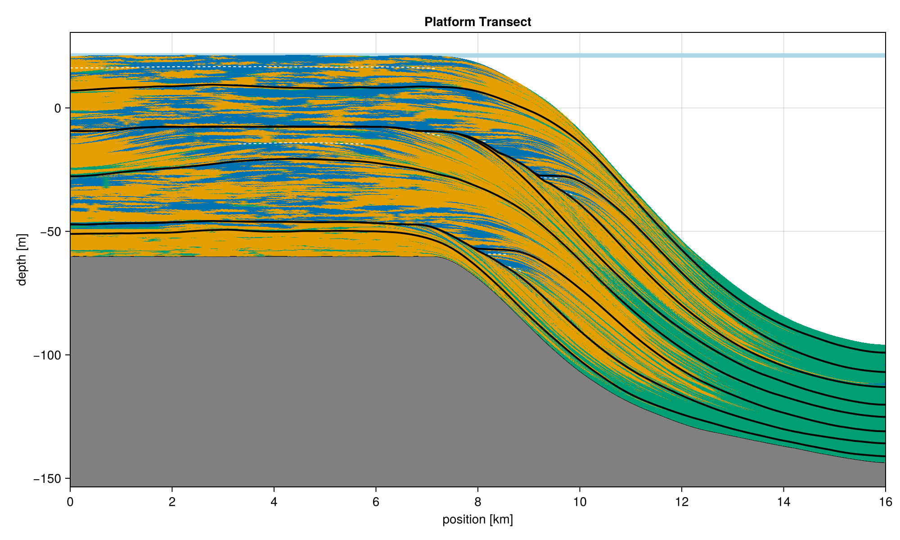

```{r setup, include=FALSE}
knitr::opts_chunk$set(echo = TRUE)
set.seed(57405)
```

## Stratigraphic Architectures and Age-Depth Models

This part of the workshop gives a first overview on the stratigraphic architecture used, and will familiarize you with the concepts of age-depth models and (stratigraphic) incompleteness. The duration is approx. 45 minutes.

## Introduction

### Example Stratigraphic Architecture

In this workshop, we use an example stratigraphic architecture simulated using CarboKitten.jl [@hidding_2025] that emulates scenario A of @hohmann_identification_2024. Here, we provide a quick overview of the setup. If you are curious you can inspect the source code underlying the simulation [here](https://github.com/MindTheGap-ERC/StratPal_data_prep) (and modify it if you like).

The simulated carbonate platform consists of three carbonate producing factories, one euphotic, one oligophotic, and one aphotic. The production profile of the factories are shown below.



The tree factories compete for space and propagate according to a cellular automaton as described in @burgess_2013. The simulation was run for 2 Myr in increments of 1 kyr. Platform growth is driven by a sinusoidal sea level curve consisting of third and fifth order sea level changes with a period of 1 and 0.112 Myr and an amplitude of 20 and 2 m, respectively.

```{r, echo=FALSE}
library(StratPal)
library(admtools)
plot(x = scenarioA$t_myr, 
     y = scenarioA$sl_m,
     type = "l",
     xlab = "Time [Myr]",
     ylab = "Sea Level [m]",
     main = "Eustatic Sea Level")

```

This results in the following synthetic carbonate platform:



Note how the platform top is dominated by the euphotic and oligophotic facies (yellow and blue), while the more distal parts are dominated by the aphotic (green) facies.

### Age-Depth Models

A core concept we use are age-depth models: The translate information between the stratigraphic domain (SI units m) where we make our observations and the time domain (SI units s or derived units such as Myr) where the biotic change we are interested is happening.

```{r, echo=FALSE}
adm = tp_to_adm(t = scenarioA$t_myr, h = scenarioA$h_m[,"2km"],
                T_unit = "Myr",
                L_unit = "m")
plot(adm, lty_destr = 0)
T_axis_lab()
L_axis_lab()

```

Age-depth models are crucial tools for stratigraphy, as they contain a lot of information:

-   The gaps in the age-depth model correspond to hiatuses, caused by nondeposition or erosion.

-   The slope of the age-depth model corresponds to the sedimentation rate - the higher the slope, the faster sediment accumulates.

-   Naturally, they can be used to determine the absolute age of events and samples from the stratigraphic domain. Conversely, they can be used to simulate data in the time domain and then predict their stratigraphic expression.

## Coding cheat sheet

Here you find a list of useful functions and code snippets that you can use to solve the tasks.

### Getting help

To find the documentation of a function, prepend its name with a question mark and execute it in the console (e.g., `?random_walk)`. The help pages are also available on the package webpage ([mindthegap-erc.github.io/StratPal/](https://mindthegap-erc.github.io/StratPal/)) under "[Reference](https://mindthegap-erc.github.io/StratPal/reference/index.html)". Long form documentation (vignettes) can be found on [the webpage](https://mindthegap-erc.github.io/StratPal/) under "Articles" or via `browseVignettes("StratPal")`.

### Loading the package and data

Load the `StratPal` and `admtools` packages via

```{r}
library("StratPal")
library("admtools")
```

to have all required functionality and example data available. We use the example data stored in the `scenarioA` variable that comes with the `StratPal` package. You can find more details on the data using `?scenarioA`.

### Creating age-depth models

Age-depth models are constructed using `tp_to_adm` (tie point to age-depth model) from the `admtools` package. Here we construct the age-depth model 2 km from shore by passing the function the vectors of times and heights at that stratigraphic position:

```{r}
pos = "2km"                                 # distance from shore
adm = tp_to_adm(t = scenarioA$t_myr,        # construct age-depth model
                h = scenarioA$h_m[,pos],
                T_unit = "Myr",
                L_unit = "m")
```

Note that we immediately add time and length units to avoid downstream confusion. The example data contains model outputs at 2, 4, 6, 8, 10, and 12 km from shore.

### Plotting Age-depth models

Age-depth models can be plotted using the standard `plot` command:

```{r}
plot(adm,           # Plot age-depth model
     lwd_acc = 2,   # plot thicker lines for intervals with sediment accumulation (lwd = line width)
     lty_destr = 0) # don't plot destructive intervals/gaps (lty = line type)
T_axis_lab()        # add time axis label
L_axis_lab()        # add length axis label
title("Age-depth model 2 km from shore")
```

See `?plot.adm` for more plotting options.

### Extracting information from age-depth models

Age-depth models contain a lot of stratigraphic information, e.g. on stratigraphic completeness, hiatuses, or sedimentation rates. Some basic functionality to extract this information is:

```{r}
get_total_duration(adm)  # time interval covered by age-depth model
get_total_thickness(adm) # sediment accumulated 
get_completeness(adm)    # stratigraphic completeness
get_hiat_duration(adm)   # extract hiatus durations
summary(adm)             # some summary statistics
```

**Stratigraphic completeness** is the proportion of deposition time represented in the geological section. Here it is calculated per stratigraphic column (1 D section), but it can also be expressed per a horizontal section (slice, 2 D) or basin (3 D).

You can find a comprehensive list of functions that extract information from age-depth models [here](https://mindthegap-erc.github.io/admtools/articles/admtools_doc.html#s3-class-adm).

### Extracting water depth

Water depth at the simulation runs is stored in the variable `scenarionA`

```{r}
pos = "2km"
wd = scenarioA$wd_m[,"2km"]
t = scenarioA$t_myr
plot(x = t,
     y = wd,
     type = "l",
     xlab = "Time [Myr]",
     ylab = "Water depth [m]",
     main = "Water depth 2 km from shore")
```

## Tasks

::: callout-important
### Task 1: Getting to know age-depth models

Define age-depth models for different locations (e.g., 4 km, 6 km etc) along the onshore-offshore gradient, and plot them.

How do they connect to the chronostratigraphic diagram and the sea level curve show above?
:::

::: callout-important
### Task 2: Incompleteness across the onshore-offshore gradient

Examine how stratigraphic incompleteness and the number of hiatuses changes along the onshore-offshore gradient.
:::

::: callout-important
### Task 3: Hiatus duration and water depth

Generate histograms of hiatus durations and plots of water depth at different distances from shore.

Do you see any systematic changes?
:::

## Solutions

::: {.callout-note collapse="true"}
### Solution Task 1: Getting to know age-depth models

```{r define age-depth models}
# load packages
library("admtools")
library("StratPal")

adm_list = list()                       # storage for age-depth models
# distances from shore
dist = paste(seq(2, 12, by = 2), "km", sep = "")      
# construct ADMs for all distances
for (pos in dist){                                    
  adm_list[[pos]] = tp_to_adm(t = scenarioA$t_myr,        
                             h = scenarioA$h_m[,pos],
                             T_unit = "Myr",
                             L_unit = "m")
}
```

Now you have a list with several age depth models. The code below plots one of them. You can modify it to plot each one separately or modify the code to plot all of them.

```{r plot specific age-depth models}
pos = "2km"               # insert distance from shore here
stopifnot(pos %in% dist ) # validity check

plot(adm_list[[pos]],
# plot thicker lines for intervals with sediment accumulation (lwd = line width)
     lwd_acc = 2,
# don't plot destructive intervals/hiatuses (lty = line type)
     lty_destr = 0)       
T_axis_lab()              # add time axis label
L_axis_lab()              # add length axis label
title(paste0("Age-depth model ", pos, " from shore"))
```

Age-depth models closer to shore cover a thicker stratigraphic height (up to 150 m) and those further offshore are shorter (a few 10s of meters). This is because sediment accumulation is much higher on the platform top (2-8 km) compared to the proximal (10 km) and distal (12 km) slope.

\
Age-depth models on the platform have a few long hiatuses that are represented as white space in the chronostratigraphic (Wheeler) diagram. These hiatuses correspond to times of falling sea level, during which the platform top is exposed subaerially. On the slope, there are fewer hiatuses as sediment accumulation is more continuous. Times of low sediment accumulation correspond to intervals of low sea level, and are due to lowstand shedding from the platform edge. This generates intervals with sedimentary condensation (low sedimentation rate), expressed by near-horizontal segments in the age-depth models.
:::

::: {.callout-note collapse="true"}
### Solution Task 2: Incompleteness across the onshore-offshore gradient

Question:\
2. Examine how stratigraphic incompleteness and the number of hiatuses changes along the onshore-offshore gradient.

```{r}
inc = rep(NA, length(dist))             # storage for incompleteness
nhiat = rep(NA, length(dist))           # storage for number of hiatuses
for (i in seq_along(dist)){
  pos = dist[i] # position in platform
  # determine incompleteness
  inc[i] = adm_list[[pos]] |> 
    get_incompleteness()
  # determine no. of hiatuses
  nhiat[i] = adm_list[[pos]] |>
    get_hiat_no()
}
## Plotting
p = seq(from = 2, to = 12, by = 2)       # dist from shore for plotting
plot(p, 100 * inc,                       # transform into %
     xlab = "Distance from shore [km]", 
     ylab = "Incompleteness [%]", 
     type = "l",
     ylim = c(0, 100))

plot(p, nhiat, 
     xlab = "Distance from shore [km]", 
     ylab = "# Hiatuses", 
     type = "l",
     ylim = c(0, max(nhiat)))
```

Incompleteness is highest in the onshore sections (more than 60 %), and decreases with distance from shore to values of around 30 % in the proximal slope. Note that this differs from Figure 4 in @hohmann_identification_2024, as we are examining incompleteness on a coarser spatial scale.

The number of hiatuses is low on the platform top (8 hiatuses at 2 - 6 km), with the highest values (16) on the platform edge (8 km). On the proximal slope, there are 12 hiatuses and the number drops to 0 in the distal slope, reflecting that this environment is less affected by sea-level fluctuations.

The hiatuses in the platform interior are generated by long intervals of low sea level, which exposes the platform top. The high number of hiatuses in the slope results from the fact that steep topography records sea-level fluctuations much more than flat topography. The distal slope is below the range of the sea-level fluctuations, so it does not undergo non-deposition or breaks in carbonate production, it is only affected by changes in low carbonate production of the aphotic factory and varying input from the platform top.
:::

::: {.callout-note collapse="true"}
### Solution Task 3: Hiatus duration and water depth

Generate histograms of hiatus durations and plots of water depth at different distances from shore. Do you see any systematic changes?

```{r}
pos = "2km" # position of adm
stopifnot(pos %in%  dist) # validity check

plot(scenarioA$t_myr, scenarioA$wd_m[,pos],
     xlab = "Time [Myr]",
     ylab = "Water depth [m]",
     type = "l",
     main = paste0("Water depth ", pos, " from shore"))

hiatus_durations <- adm_list[[pos]] |>
  get_hiat_duration()

if (length(hiatus_durations) == 0) {
  stop("No hiatuses at position ", pos)
}

hiatus_durations |>
  hist(xlab = "Hiatus duration [Myr]",
       main = paste0("Hiatus duration ", pos, " from shore"))
```
#### Hiatus duration

The distribution of hiatus durations in the platform interior is bimodal: it consists of two long hiatuses (caused by the prolonged drops in the sea level) and six shorter hiatuses generated by the lower-order sea level changes.

At 8 km from shore, the number of short hiatuses increases to 14, reflecting the steep topography of the platform edge.

On the slope, hiatuses are more abundant, but their duration is much shorter. This is most pronounced for the proximal slope. In the distal slope (12 km) you might get an error: this is because there are no hiatuses.

Note the disconnect between the number of hiatuses and incompleteness: Onshore sections are the most incomplete, but have only a few hiatuses. In contrast, the proximal slope has the most hiatuses, but a low incompleteness. This is because hiatus duration in the onshore sections is much longer.

#### Water depth

In the platform top (2 km), water depth is 0 for the largest part of the studied 1 Myr, with an initial flooding and two subsequent rises corresponding to the highest points of the first-order sea-level cycles.

On the platform edge (8 km), the water depth reaches a maximum of 30 m in the initial flooding phase, but it is still emerged for a large part of the interval. The upper slope remains under water for all the time of the simulation, reflecting how different platform top and platform slopes are in terms of deposition. 

The strong cyclicity of the sea-level curve is still visible at 12 km offshore, where the water depth oscillates between 45 and 90 m.
:::
